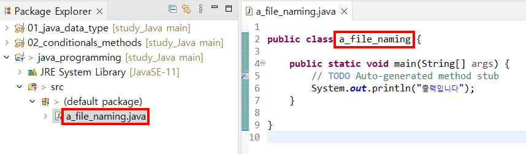

# Java
## Java 
- C계열 프로그래밍 언어 (C와 C++이 원천)
- 1991년 제임스 고슬링에 의해 개발됨 (이 때는 Oak라는 이름의 언어)

## Java 의 특징
- 단순성 : c++에 비해 단순 (포인터(Pointer) 없음. 그저 참조(Reference)할 뿐)  
> cf) 포인터 : 직접 메모리 주소에 접근해 해당 주소 값을 임의의 메모리 주소로 변경할 수 있다
- 안전성 : 포인터x, 바이트 코드 변수
- 이식성 : 매우 가벼워 어떠한 플랫폼에서도 실행 가능
- 객체 지향성
- 강력성
- 다중 스레드
- 인터프리터 :   
프로그램 작성시 - 클래스 파일로 편집되어 실행.  
문장 해석시 - 바이트 코드로 번역되어 빠르게 이식되므로 인터프리터의 느린 단점 보완

## Java 프로그램의 실행 단계
1. 자바 소스 코드 (\*.java) $\rarr$ 자바 컴파일러 $\rarr$ 자바 바이트 코드 (\*.class)
2. 자바 바이트 코드 $\rarr$ 자바 가상기계 컴퓨터 $\rarr$ 실행결과
> 자바 가상기계 컴퓨터 (JVM, Java Virtual Machine) :  
> 컴퓨터에서는 직접 바이트 코드를 수행하지 않고 JVM 이라는 프로그램에 바이트 코드를 넣어서 번역하고 실행한다

## 내부 키워드
- class 키워드 :   
  모든 자바 프로그램은 클래스를 1개 이상 가짐.  
  컴파일 시 **.class** 라는 확장자가 붙는다.
- main 메소드 :  
  함수라는 이름 대신 메소드라는 말을 사용함.  
  **String 타입**의 **args 라는 매개 변수**로 **main 메소드**의 출력(리턴값)은 **void(어떠한 값도 출력하지 않음)**
- Block의 의미 :  
  ( ) : 메소드, 수식의 우선순위  
  { } : Block의 시작과 끝  
  [ ] : 배열 선언 및 요소 지정  
- 변수 : a-z A-Z, _ , $ 로 시작해야 한다. (대,소문자 구분)
> 일반적으로 main() 메소드를 포함한 클래스명에 확장자 .java를 붙여 소스 파일의 이름으로 지정한다.  
> (클래스 명과 파일 이름이 다르면 에러 발생)
> 

## 자바 개발 환경
- javac.exe :  
  소스 코드 (**\*.java**) 를 컴파일하여 바이트 코드 (**\*.class**) 를 작성  
  > javac　**옵션**　파일이름.java  

  옵션 :  
  -classpath 경로  
  -d 디렉토리  
  -g  
  -nowarn  
  -verbose  
  -O  

- java.exe :  
  바이트 코드 (**\*.class**) 를 실행시키기 위한 **인터프리터**
  > java　**옵션**　클래스이름  

  옵션 :  
  -debug    
  -cs, -checksource  
  -classpath 경로  
  -mx x  
  -ms x  
  -noasyncgc  
  -ss x  
  -oss x  

## JDK
: Java Development Kit
