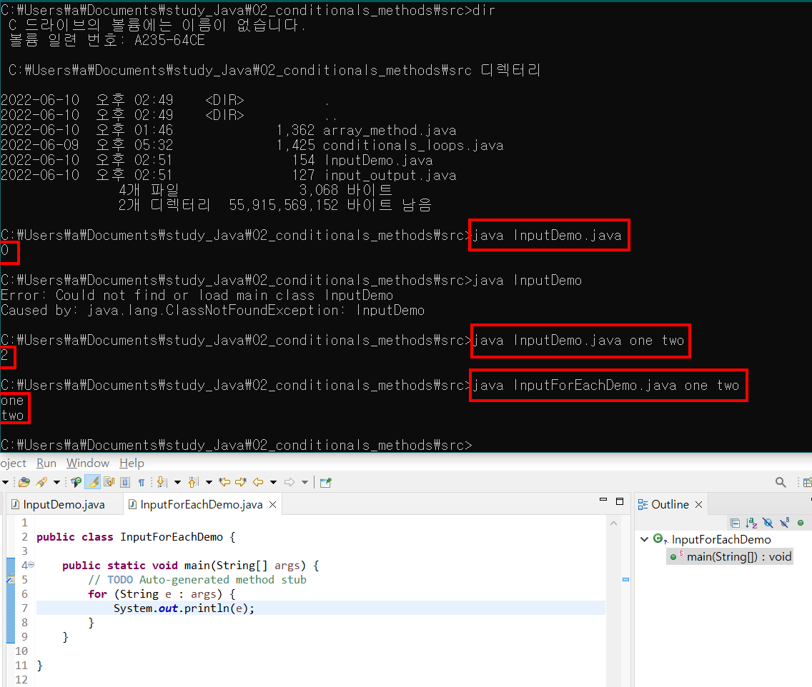
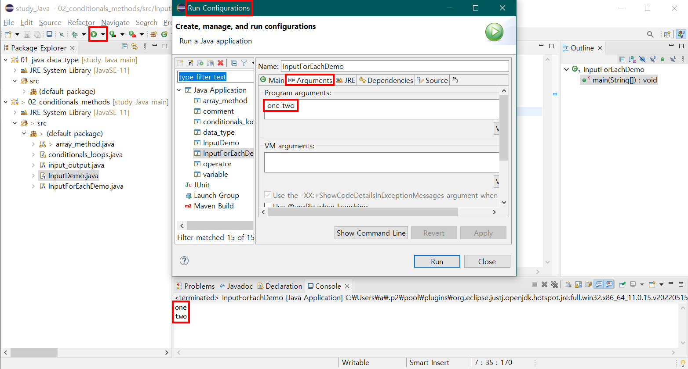
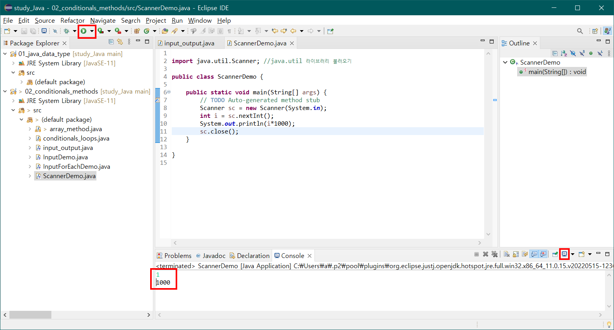
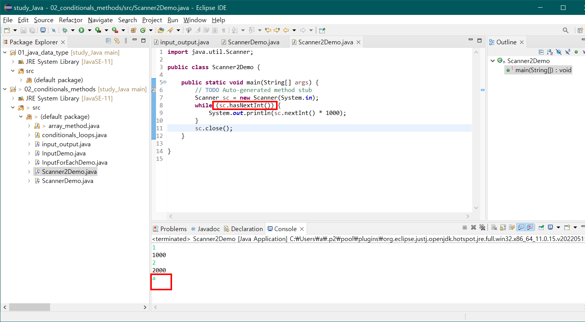

# study_Java

## 02_ Java의 class에 args 값을 input으로 넣어 출력하기

> java InputForEachDemo.java one two  

## 02_ Eclipse 의 Run configuration 에서 args 값을 input으로 넣어 출력하기

## 02_ Eclipse 에서 run 시킨 후, Console 창에서 input 을 넣어 출력 바로 보기

## 02_ while 문을 통해 input 받기, 지정되지 않은 type 을 input 으로 받았을 때
